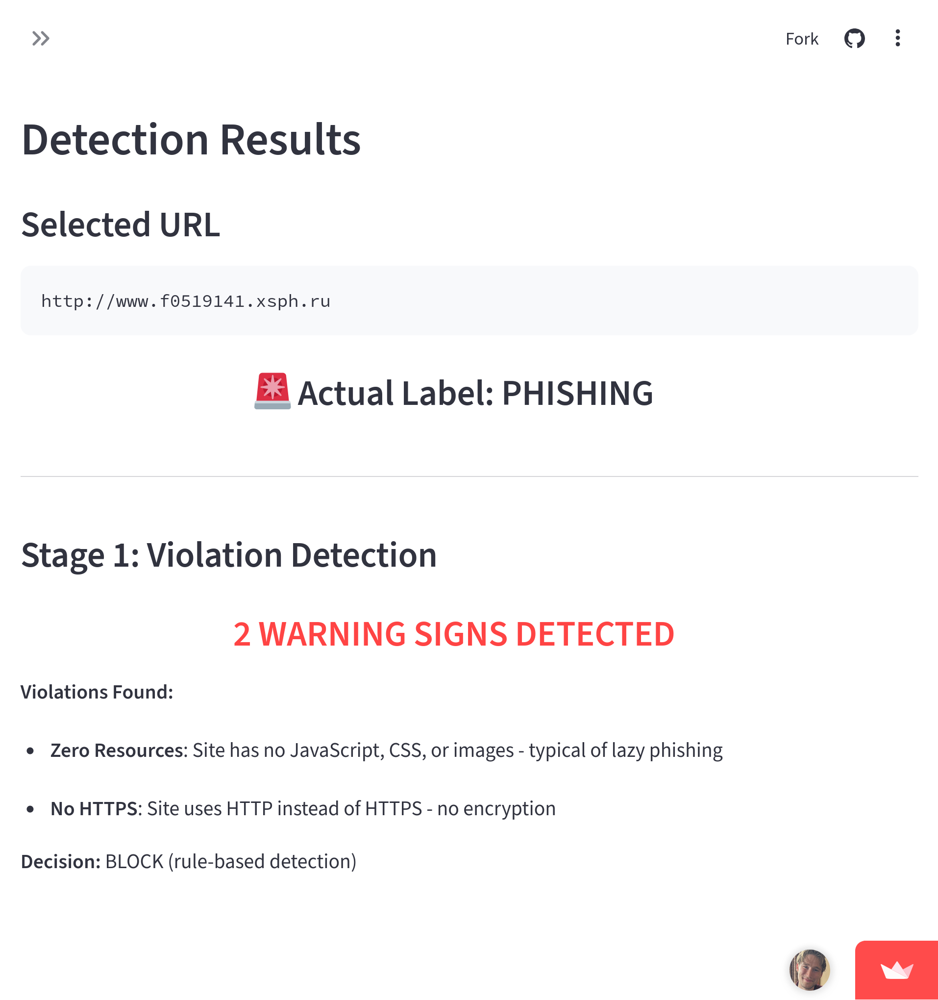

# Phishing URL Detection System

[](https://pp5-phising.streamlit.app/)

[](https://github.com/d0bledore/kaggle-phising-url-dataset/commits/main)
[](https://github.com/d0bledore/kaggle-phising-url-dataset/commits/main)
[](https://github.com/d0bledore/kaggle-phising-url-dataset)

A hybrid machine learning system combining rule-based filtering with XGBoost classification to detect phishing URLs.



## Key Results

| Metric | Score |
|--------|-------|
| Recall | 99.995% |
| False Positive Rate | 0% |
| Rule Coverage | 86.4% |
| ML Coverage | 13.6% |

## Quick Start

```bash
git clone https://github.com/d0bledore/kaggle-phising-url-dataset.git
cd kaggle-phising-url-dataset
pip install -r requirements.txt
streamlit run app.py
```

Or try the [Live Demo](https://pp5-phising.streamlit.app/) instantly.

---

## Features

The Streamlit dashboard consists of 5 pages:

| Page | Description |
|------|-------------|
| **Project Summary** | Business requirements, dataset overview, terminology |
| **Data Study** | Dataset distribution, HTTPS analysis, detection rules, coverage |
| **Hypothesis & Validation** | 6 hypotheses with statistical validation |
| **ML Performance** | Model comparison, confusion matrix, feature importance |
| **Detection Demo** | Interactive URL testing with violation detection |

### Design Philosophy

- **Search-Driven**: Users search 235K URLs (dropdown would be unusable)
- **Comprehensive Violations**: Shows ALL warning signs, not just first match
- **Educational Focus**: Clear explanations for every metric and visualization

---

## Dataset

### Dataset Source

**Dataset:** Phishing Website Detection Datasets

**Author:** Md Sultanul Islam Ovi

**Platform:** Kaggle

**URL:** https://www.kaggle.com/datasets/mdsultanulislamovi/phishing-website-detection-datasets

### Dataset Content

The project uses **dataset4.csv** from the collection:
- **Total URLs**: 235,795 (100,945 phishing, 134,863 legitimate)
- **Features**: 56 total features (49 used for ML)
- **Feature Types**:
  - Structural: URL length, number of subdomains, special characters
  - Behavioral: HTTPS usage, resource counts (JS, CSS, images)
  - Content: Title, favicon, description, copyright info, social links
- **Label**: Binary classification (0 = phishing, 1 = legitimate)

### Why This Dataset?

Dataset4 was selected after comparing 6 available datasets (see Notebook 1) based on:
- Largest size for ML training (235K URLs vs 10-11K in others)
- Interpretable features (clear naming like URLLength, IsHTTPS, NoOfSubDomain)
- Good feature balance (56 features - not too sparse, not excessive)
- Clean data quality (no parsing errors or mixed types)
- No data leakage issues

### License

Apache 2.0 - https://www.apache.org/licenses/LICENSE-2.0

### Citation

```bibtex
@inproceedings{ovi2024phishguard,
  title={PhishGuard: A Multi-Layered Ensemble Model for Optimal Phishing Website Detection},
  author={Ovi, Md Sultanul Islam and Rahman, Md Hasibur and Hossain, Mohammad Arif},
  booktitle={2024 6th International Conference on Sustainable Technologies for Industry 5.0 (STI)},
  pages={1--6},
  year={2024},
  organization={IEEE}
}
```

---

## Business Requirements

### Project Background

Phishing attacks remain one of the most prevalent cyber threats, with attackers creating fraudulent websites to steal credentials and sensitive information. Traditional blacklist-based detection systems struggle to keep pace with new phishing sites appearing daily.

### Target Users

Small security consulting firm staff who need to:
- Quickly assess URL safety for client consultations
- Explain WHY a URL is flagged (for security awareness training)
- Make confident decisions with minimal false alarms

### Core Business Requirements

The project addresses 3 critical business needs:

**BR1: Identify Key Phishing Indicators**
- Analyze URL features to determine which patterns reliably distinguish phishing from legitimate sites
- **Success Criteria**: Develop data-driven rules with statistical validation
- **Deliverable**: 6 perfect-precision detection rules backed by hypothesis testing

**BR2: Build Hybrid Detection System**
- Develop perfect-precision rules for obvious phishing cases
- Use machine learning for sophisticated cases that bypass rules
- **Success Criteria**: Rules + ML together catch 99%+ of phishing
- **Deliverable**: Hybrid system with 86.4% rule coverage, 13.6% ML coverage

**BR3: Achieve High Recall with Zero False Positives**
- Catch 99%+ of phishing URLs (high recall)
- Never block legitimate sites (zero false positives)
- **Success Criteria**: 99%+ recall, 0% false positive rate
- **Deliverable**: System achieving 99.99% total recall, 0% FP rate

### User Stories

**As a security consultant**, I want to quickly check if a client's URL is safe, so I can provide immediate guidance during consultations.

**As a trainer**, I want to see ALL warning signs for a phishing URL (not just one), so I can use it as an educational example in security awareness training.

**As a business owner**, I need zero false positives in our detection system, so we never incorrectly block legitimate client websites (which would damage our reputation).

---

## Technical Approach

### Hypotheses and Validation

Before building the detection system, 6 hypotheses were formulated based on domain knowledge about phishing attacks. Each was systematically validated using the dataset.

#### Behavioral Hypotheses

**H1: Resource Minimalism**
- **Hypothesis**: Phishing sites use significantly fewer web resources (JS, CSS, images) than legitimate sites
- **Rationale**: Attackers prioritize speed over quality for quick deployment
- **Validation**: 68.56% of phishing have zero resources vs 0.01% of legitimate (6856x difference)
- **Result**: VALIDATED ✓ → Justifies Rule 1 (Zero Resources)

**H2: HTTPS Gap**
- **Hypothesis**: Phishing sites are less likely to use HTTPS encryption
- **Rationale**: SSL certificates require domain validation, creating barriers for temporary/fake domains
- **Validation**: 50.78% of phishing lack HTTPS vs 0% of legitimate (100% of legitimate use HTTPS)
- **Result**: VALIDATED ✓ → Justifies Rule 2 (No HTTPS)

**H3: Trust Signal Absence**
- **Hypothesis**: Phishing sites lack trust signals (title, favicon, description, copyright)
- **Rationale**: Legitimate businesses invest in branding; phishing sites skip details to deploy faster
- **Validation**: 31.10% of phishing have zero trust signals vs 0.01% of legitimate (3110x difference)
- **Result**: VALIDATED ✓ → Justifies Rule 4 (Zero Trust Signals)

#### Technical Hypotheses

**H4: IP Address Domain Usage**
- **Hypothesis**: Phishing sites use IP addresses as domains instead of registered names
- **Rationale**: Attackers avoid domain registration costs and blacklist detection
- **Validation**: 0.63% of phishing use IP domains vs 0% of legitimate (perfect precision)
- **Result**: VALIDATED ✓ → Justifies Rule 3 (Domain is IP)

**H5: Subdomain Obfuscation**
- **Hypothesis**: Phishing sites use excessive subdomains (≥5) to obfuscate and evade detection
- **Rationale**: Deep nesting (login.secure.verify.account.site.com) appears legitimate at first glance
- **Validation**: 0.37% of phishing use 5+ subdomains vs 0% of legitimate (perfect precision)
- **Result**: VALIDATED ✓ → Justifies Rule 5 (Excessive Subdomains)

**H6: URL Length Obfuscation**
- **Hypothesis**: Phishing sites use longer URLs (>57 chars) to hide malicious intent
- **Rationale**: Long URLs can hide suspicious domains in parameters or use redirect chains
- **Validation**: 16.98% of phishing exceed 57 chars vs 0% of legitimate (perfect precision)
- **Result**: VALIDATED ✓ → Justifies Rule 6 (Long URL)

All 6 hypotheses were validated with strong statistical evidence, directly informing the 6 detection rules.

### Machine Learning

#### Why Machine Learning?

**Problem**: After developing 6 perfect-precision rules, 13.6% of phishing (13,740 URLs) still passed through. These sophisticated phishing sites mimicked legitimate patterns across all 6 rules.

**Traditional Approach Limitation**: Individual weak signals had insufficient precision:
- HasSocialNet=0: Only 78.38% precision (would block 27,704 legitimate sites)
- Robots=0: Only 54.52% precision (would block 78,653 legitimate sites)
- IsResponsive=0: Only 77.82% precision (would block 19,639 legitimate sites)

**ML Solution**: Combine weak signals intelligently to achieve high precision without false positives.

#### Model Selection

**Algorithms Considered:**

1. **Logistic Regression** - Not selected
   - Assumes features work independently
   - Cannot learn feature interactions (HasSocialNet=0 AND Robots=0 AND IsResponsive=0)

2. **Random Forest** - Strong candidate
   - Learns decision tree rules automatically
   - Can discover feature combinations
   - Achieved: 99.975% recall, 100% precision (missed 5 phishing)

3. **XGBoost** - Selected for deployment
   - Advanced gradient boosting (each tree focuses on fixing previous mistakes)
   - Achieved: 99.995% recall, 100% precision (missed only 1 phishing)
   - Better performance: caught 4 of the 5 phishing Random Forest missed

**Final Decision**: XGBoost selected for highest recall while maintaining zero false positives.

#### Business Value

**Quantified Benefits:**

- **High Coverage**: Total system recall ~99.99% (rules + ML combined)
- **Zero False Positives**: 0% legitimate sites blocked (preserves business reputation)
- **Explainability**: Feature importance shows which combinations drive predictions
- **Efficiency**: 86.4% caught instantly by rules, only 13.6% require ML scoring

**Cost-Benefit Analysis:**

- **Cost of False Negative** (missed phishing): Client compromise, reputation damage
- **Cost of False Positive** (blocked legitimate): Business reputation loss, client frustration
- **System Performance**: 99.99% recall minimizes FN, 0% FP eliminates FP costs
- **Business Outcome**: Consultant staff can confidently use system for client guidance

---

## Project Structure

```
.
├── data/
│   └── dataset4.csv                    # Selected dataset (235,795 URLs, 55MB)
├── models/
│   └── xgb_model.pkl                   # Trained XGBoost model
├── src/
│   ├── __init__.py
│   ├── data_management.py              # Data loading with caching
│   └── detection.py                    # Violation detection logic
├── app_pages/
│   ├── __init__.py
│   ├── page_summary.py                 # Project overview
│   ├── page_study.py                   # Data analysis
│   ├── page_hypothesis.py              # Hypothesis validation
│   ├── page_performance.py             # Model performance
│   └── page_detection.py               # Interactive demo
├── 1. Exploration.ipynb                # Dataset exploration
├── 2. Rule-Based Model.ipynb           # Rule development
├── 3. ML Model.ipynb                   # XGBoost training
├── 4. Deployment.ipynb                 # Model deployment
├── app.py                              # Streamlit orchestrator
├── requirements.txt                    # Python dependencies
├── archive.zip                         # Original dataset archive
├── .gitignore                          # Git exclusions
└── README.md                           # Documentation
```

---

## Installation and Usage

### Prerequisites

- Python 3.9+
- pip package manager

### Installation

1. Clone the repository:
```bash
git clone https://github.com/d0bledore/kaggle-phising-url-dataset.git
cd kaggle-phising-url-dataset
```

2. Install dependencies:
```bash
pip install -r requirements.txt
```

### Running the Dashboard

Launch the Streamlit dashboard:
```bash
streamlit run app.py
```

Access the dashboard at: http://localhost:8501

### Using the Dashboard

1. **Navigate pages** using the sidebar menu
2. **Search for URLs** in the Detection Demo page
   - Try: "google", ".top", "blogspot", "seedjfly"
3. **View violations** and ML predictions
4. **Explore data analysis** in Data Study page
5. **Review model performance** in ML Performance page

### Running Jupyter Notebooks

Execute notebooks in order:
```bash
jupyter notebook
```

1. Exploration.ipynb - Dataset selection and feature investigation
2. Rule-Based Model.ipynb - Detection rules development
3. ML Model.ipynb - XGBoost model training
4. Deployment.ipynb - Production model and dashboard creation

---

## Deployment

### Live Application

The dashboard is deployed on Streamlit Cloud:

**https://pp5-phising.streamlit.app/**

### Deployment Details

**Platform:** Streamlit Cloud (Free Tier)

**Deployment Process:**
1. Repository connected to Streamlit Cloud via GitHub
2. Auto-deploys on push to main branch
3. Installs dependencies from requirements.txt
4. Loads data/dataset4.csv (55MB) and models/xgb_model.pkl
5. Live in ~2 minutes after each push

**Requirements:**
- Data files committed to repo (dataset4.csv and xgb_model.pkl)
- ~500MB RAM (free tier covers this)
- Python 3.9+ with requirements.txt dependencies

### Local Development

```bash
streamlit run app.py
```
Access at: http://localhost:8501

---

## Technologies Used

### Core Technologies

- **Python 3.8+** - Primary programming language
- **Jupyter Notebook** - Interactive development environment
- **Streamlit** - Dashboard framework for interactive web app

### Data Science Libraries

- **pandas** - Data manipulation and analysis
- **NumPy** - Numerical computing
- **scikit-learn** - ML utilities (train/test split, metrics)
- **XGBoost** - Gradient boosting ML algorithm

### Visualization

- **Matplotlib** - Base plotting library
- **Seaborn** - Statistical data visualization (confusion matrix, feature importance)

### Development Tools

- **Git** - Version control
- **pickle** - Model serialization

---

## Credits

### Dataset

**Author**: Md Sultanul Islam Ovi

**Source**: [Kaggle - Phishing Website Detection Datasets](https://www.kaggle.com/datasets/mdsultanulislamovi/phishing-website-detection-datasets)

**License**: Apache 2.0

**Original Paper**:
Ovi, M. S. I., Rahman, M. H., & Hossain, M. A. (2024). PhishGuard: A Multi-Layered Ensemble Model for Optimal Phishing Website Detection. *2024 6th International Conference on Sustainable Technologies for Industry 5.0 (STI)*, 1-6. IEEE.

### Content and Documentation

**Official Documentation Referenced**:
- [Streamlit Documentation](https://docs.streamlit.io/) - Dashboard framework and component usage
- [XGBoost Documentation](https://xgboost.readthedocs.io/) - Model training and parameter tuning
- [scikit-learn Documentation](https://scikit-learn.org/stable/documentation.html) - ML utilities and metrics
- [pandas Documentation](https://pandas.pydata.org/docs/) - Data manipulation techniques
- [Matplotlib Documentation](https://matplotlib.org/stable/contents.html) - Visualization plotting
- [Seaborn Documentation](https://seaborn.pydata.org/) - Statistical visualizations

**Code Institute Learning Resources**:
- Predictive Analytics walkthrough projects
- Machine Learning module content
- Dashboard deployment guidelines

### Media

No external media or images were used in this project. All visualizations are generated programmatically using Matplotlib and Seaborn.

### Project Development

This project was developed as part of the **Code Institute Portfolio Project 5 (Predictive Analytics)** assessment.

**Key Learning Outcomes Demonstrated**:
- **LO1**: Data collection and preparation from multiple datasets
- **LO2**: Data visualization and insight communication with interpretations
- **LO3**: Hypothesis formulation and systematic validation
- **LO4**: Model training, evaluation, and comparison
- **LO5**: Jupyter notebook documentation with Objectives/Inputs/Outputs
- **LO6**: Interactive dashboard with multi-page structure
- **LO7**: Code deployment (Streamlit application with modular structure)

### Acknowledgments

I am deeply grateful to **Code Institute** for providing me with this incredible opportunity to develop practical machine learning skills. The comprehensive curriculum, supportive learning community, and structured assessment framework have been instrumental in my growth as a data scientist.

Special thanks to:
- **Code Institute Mentors and Tutors** for guidance throughout the project development
- **Kaggle Community** for maintaining high-quality, accessible datasets for ML research
- **XGBoost Development Team** for creating a powerful, well-documented gradient boosting library
- **Streamlit Team** for developing an intuitive framework that makes ML deployment accessible
- **Open Source Community** for the excellent Python data science ecosystem (pandas, NumPy, scikit-learn, Matplotlib, Seaborn)

This project represents not just a technical achievement, but a significant milestone in my journey toward a career in data science and machine learning.

---

## Known Issues and Future Improvements

### Current Limitations

**Demo Mode Only**
- Dashboard tests URLs from the training dataset (not live web scanning)
- In production, would need real-time feature extraction from live URLs
- Trade-off: Focuses on ML demonstration rather than web scraping complexity

**Circular Validation**
- Model trained and tested on same dataset (acknowledged limitation)
- Performance shows what's POSSIBLE, not guaranteed in production
- Future: Test on external datasets or live phishing URLs

**The One That Got Away**
- 1 phishing URL (0.005%) evades even XGBoost detection
- Perfectly mimics legitimate sites across all 49 features
- Future: Content analysis (page text, form fields) could catch these edge cases

### Future Improvements

**Feature Enhancements**:
- Real-time URL scanning with live feature extraction
- Content analysis (detect credential harvesting forms)
- Domain reputation integration (WHOIS, age, traffic)
- Continuous learning (retrain on new phishing patterns)

**System Enhancements**:
- API endpoint for programmatic access
- Batch URL processing
- Historical tracking (URL reputation over time)
- Email integration (scan links in emails)

---

## License

This project is licensed under the MIT License. See [LICENSE](LICENSE) for details.
